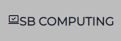
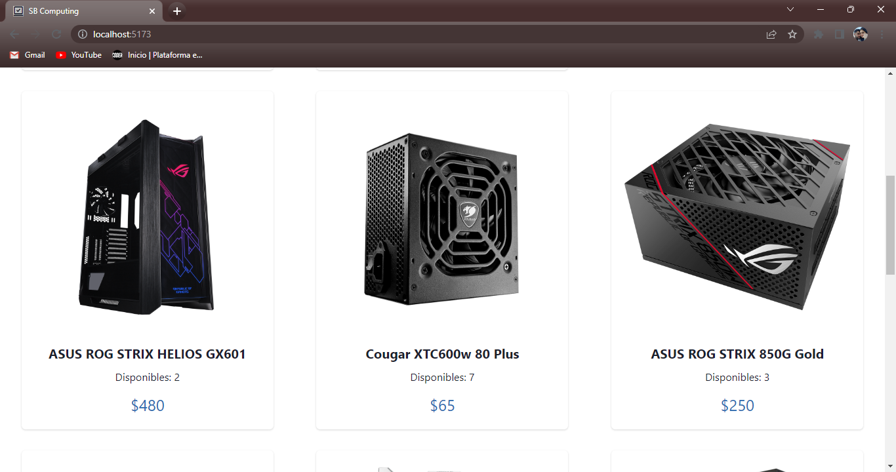

#### 🚧Proyecto en desarrollo🚧

**eCommerce para empresa dedicada a los ordenadores**

En el componente principal de la aplicación se mostrará una galería con los ordenadores que ya ha vendido la empresa, para mostrar parte de la experiencia de la misma. (En construcción🚧)

Cuenta con una gran variedad de productos, desde ordenadores ya armados, notebooks, componentes, periféricos e incluso monitores, por los cuales podremos navegar apreciando: 

1. _Nombre_
1. _Stock_
1. _Precio_

Se podrá filtrar los productos por _Categoría_, _Marca_ (En construcción🚧) y _Compatibilidad_ (En construcción🚧).

Dentro de la categoría Componentes se abrirá otra opción de filtrados por el tipo de componente: _Gabinetes_, _Procesadores_, _Gráficas_, _etc._ (En construcción🚧).

Los productos se mostrarán en tarjetas clickeables que nos dirigirán a más información sobre el mismo.
Allí encontraremos la información incluida en la anterior tarjeta, y además:

1. _Descripción_
1. _Compatibilidad_ (En construcción🚧)
1. **_Funcionalidad para agregar al carrito_**

Dentro de dicha funcionalidad encontraremos un contador donde sumaremos la cantidad de productos que nos interesan, para luego agregarlos a nuestro carrito mediante un botón (En construcción🚧).

### Tecnologías empleadas:

1. **ReactJS**
1. **Chakra**
1. **SCSS**(En construcción🚧)

### Desarrollador:

_Santiago Bertora_ 